# ERD — `healthweb` 스키마

Oracle Autonomous DB(SHINDB), `healthweb` 전용 유저로 접속. 마이그레이션 파일: `sql/010`~`sql/046` (순서대로 적용).
`BLOCK`·`COMMENT`가 Oracle 예약어라 테이블명은 `user_block`·`post_comment`를 쓴다.

```mermaid
erDiagram
    APP_USER ||--o{ WEIGHT_ENTRY : "기록한다"
    APP_USER ||--o{ POST : "작성한다"
    APP_USER ||--o{ MEDIA : "업로드한다"
    APP_USER ||--o{ CHALLENGE : "만든다(owner)"
    APP_USER ||--o{ CHALLENGE_MEMBER : "참여한다"
    APP_USER ||--o{ CHALLENGE_CHECKIN : "체크인한다"
    APP_USER ||--o{ ENCOURAGEMENT : "응원한다"
    APP_USER ||--o{ POST_COMMENT : "댓글단다"
    APP_USER ||--o{ NOTIFICATION : "받는다(login_id)"
    APP_USER ||--o{ NOTIFICATION : "발생시킨다(actor)"
    APP_USER ||--o{ FOLLOW : "팔로우한다(follower)"
    APP_USER ||--o{ FOLLOW : "팔로우당한다(followee)"
    APP_USER ||--o{ USER_BLOCK : "차단한다(blocker)"
    APP_USER ||--o{ USER_BLOCK : "차단당한다(blocked)"
    APP_USER ||--o{ REPORT : "신고한다(reporter)"
    APP_USER ||--o{ ANNOUNCEMENT : "작성한다(created_by, 오너)"
    APP_USER ||--o| MEDIA : "아바타로 쓴다(avatar_media_id)"
    APP_USER ||--o| TG_LINK_CODE : "발급받는다"
    APP_USER ||--o{ PURCHASE_ITEM : "구매 기록한다(erp_access 부여자만)"

    PURCHASE_ITEM }o--o| MEDIA : "영수증 원본(source_media_id)"
    PURCHASE_ITEM }o--o| MEDIA : "AI 크롭 상품 사진(thumb_media_id)"

    WEIGHT_ENTRY ||--o| POST : "글로 공유될 수 있다"
    WEIGHT_ENTRY }o--o| MEDIA : "진행 사진(photo_media_id)"
    POST }o--o| MEDIA : "글 사진(image_media_id)"
    POST ||--o{ ENCOURAGEMENT : "응원받는다"
    POST ||--o{ POST_COMMENT : "댓글달린다"
    POST ||--o{ NOTIFICATION : "관련된다(post_id)"

    CHALLENGE ||--o{ CHALLENGE_MEMBER : "참여자"
    CHALLENGE ||--o{ CHALLENGE_CHECKIN : "체크인 기록"

    APP_USER {
        varchar2 login_id PK "비공개, 로그인용"
        varchar2 name UK "공개 handle"
        varchar2 password_hash
        varchar2 bio
        varchar2 link
        varchar2 location
        number target_weight
        varchar2 weight_privacy "private/trend/public"
        number pinned_post_id FK
        number avatar_media_id FK
        number tg_chat_id "텔레그램 연동, nullable"
        number rank_score "등급 누적 점수"
        number rank_level "1~5, 기본 1"
        number erp_access "0/1, 기본 0 — 오너가 개별 부여하는 ERP 접근 권한"
    }
    WEIGHT_ENTRY {
        number id PK
        varchar2 login_id FK
        timestamp logged_at
        number weight
        varchar2 note
        number photo_media_id FK
    }
    POST {
        number id PK
        varchar2 login_id FK
        varchar2 kind "brag/resolve/reflect/casual — 표시 라벨은 자랑/도전/성찰/그냥"
        varchar2 body
        number weight_entry_id FK "nullable"
        number image_media_id FK "nullable"
    }
    ENCOURAGEMENT {
        number post_id PK
        varchar2 login_id PK
    }
    POST_COMMENT {
        number id PK
        number post_id FK
        varchar2 login_id FK
        varchar2 body
    }
    FOLLOW {
        varchar2 follower PK
        varchar2 followee PK
    }
    USER_BLOCK {
        varchar2 blocker PK
        varchar2 blocked PK
    }
    CHALLENGE {
        number id PK
        varchar2 owner FK
        varchar2 title
        varchar2 description
        number target_days
    }
    CHALLENGE_MEMBER {
        number challenge_id PK
        varchar2 login_id PK
    }
    CHALLENGE_CHECKIN {
        number challenge_id PK
        varchar2 login_id PK
        varchar2 check_date PK "YYYY-MM-DD, 사용자 로컬"
    }
    NOTIFICATION {
        number id PK
        varchar2 login_id FK "수신자"
        varchar2 kind "encourage/comment/follow/rank"
        varchar2 actor FK "발생시킨 사람(rank는 본인)"
        number post_id FK "nullable"
        number rank_level "kind=rank일 때만"
        timestamp read_at
    }
    MEDIA {
        number id PK
        varchar2 login_id FK
        varchar2 kind "avatar/progress/post/receipt/item_thumb"
        varchar2 path
        varchar2 thumb_path
        number width
        number height
        number bytes
    }
    PURCHASE_ITEM {
        number id PK
        varchar2 login_id FK
        varchar2 shop_name "nullable"
        varchar2 product_name
        varchar2 option_text "nullable"
        number quantity "기본 1"
        number price_cny "nullable"
        number price_krw "nullable"
        number fx_rate "추출 시점 CNY→KRW 환율, nullable"
        timestamp fx_at "nullable"
        varchar2 order_date "YYYY-MM-DD, nullable"
        number source_media_id FK "영수증 원본, nullable"
        number thumb_media_id FK "AI가 크롭한 상품 사진, nullable"
        timestamp created_at
    }
    REPORT {
        number id PK
        varchar2 reporter FK
        varchar2 target_kind "post/comment/user"
        varchar2 target_id "숫자ID 또는 login_id"
        varchar2 reason
        varchar2 status "open/closed"
    }
    ANNOUNCEMENT {
        number id PK
        varchar2 title
        varchar2 body
        varchar2 link
        timestamp starts_at "nullable"
        timestamp ends_at "nullable"
        varchar2 created_by FK
    }
    TG_LINK_CODE {
        varchar2 code PK "일회용, 10분 TTL"
        varchar2 login_id FK
        timestamp created_at
    }
```

## 마이그레이션 이력

| 파일 | 내용 |
|---|---|
| `001~003` | 초기 유저·이메일 인증(현재 미사용, 레거시) |
| `010` | Phase 1 — `app_user·weight_entry·post·encouragement·post_comment` |
| `011` | 오너 계정으로 구 텔레그램 이력 이관(1회성 스크립트) |
| `020` | Phase 2 — `follow·challenge·challenge_member·challenge_checkin·notification` |
| `030` | Phase 3a — `app_user`+`link/location/pinned_post_id`, `user_block`, 검색 함수 인덱스 |
| `040` | Phase 3b — `media`, `app_user`+`avatar_media_id`, `weight_entry`+`photo_media_id`, `post`+`image_media_id`, `report` |
| `041` | 텔레그램 알림 — `app_user`+`tg_chat_id`, `tg_link_code` |
| `042` | 관리자 공지 — `announcement` |
| `043` | 등급 — `app_user`+`rank_score/rank_level`, `notification`+`rank_level`, kind 체크 제약에 `'rank'` 추가 |
| `044` | 글 종류 재편 — `post.kind` 값 교체(brag/resolve/reflect/casual, 표시 라벨 자랑/도전/성찰/그냥), 기존 데이터 최선 추정 매핑 |
| `045` | ERP 구매 기록 — `app_user`+`erp_access`, `purchase_item` 신설, `media.kind` 체크 제약에 `'receipt'` 추가 |
| `046` | ERP 상품 사진 — `purchase_item`+`thumb_media_id`, `media.kind` 체크 제약에 `'item_thumb'` 추가 |

## 알려진 특이사항

- `notification.actor`는 NOT NULL FK라서, "시스템이 보내는" 등급 알림도 `actor=수신자 자신`으로 저장한다(자기참조).
- `challenge_checkin.check_date`는 UTC가 아니라 **사용자가 보낸 문자열 그대로**(`YYYY-MM-DD`) 저장 — 타임존 변환 없음.
- `report.target_id`는 `post`/`comment`면 숫자 ID 문자열, `user`면 `login_id` — 컬럼 하나가 두 가지 의미를 가짐.
- `media.kind`는 `varchar2(12)` — 새 kind 값을 추가할 때 12자를 넘기면 ORA-12899. `'purchase_thumb'`(14자)로 시도했다가 실패해 `'item_thumb'`(10자)로 줄임(`sql/046`).
