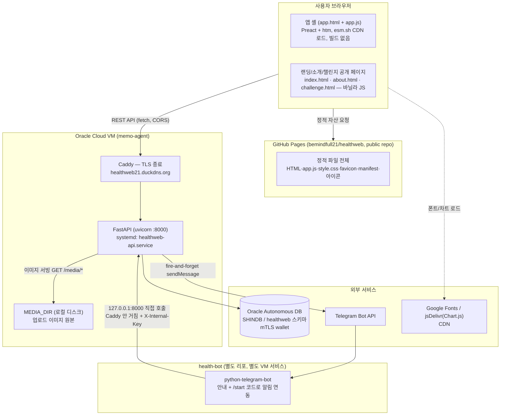
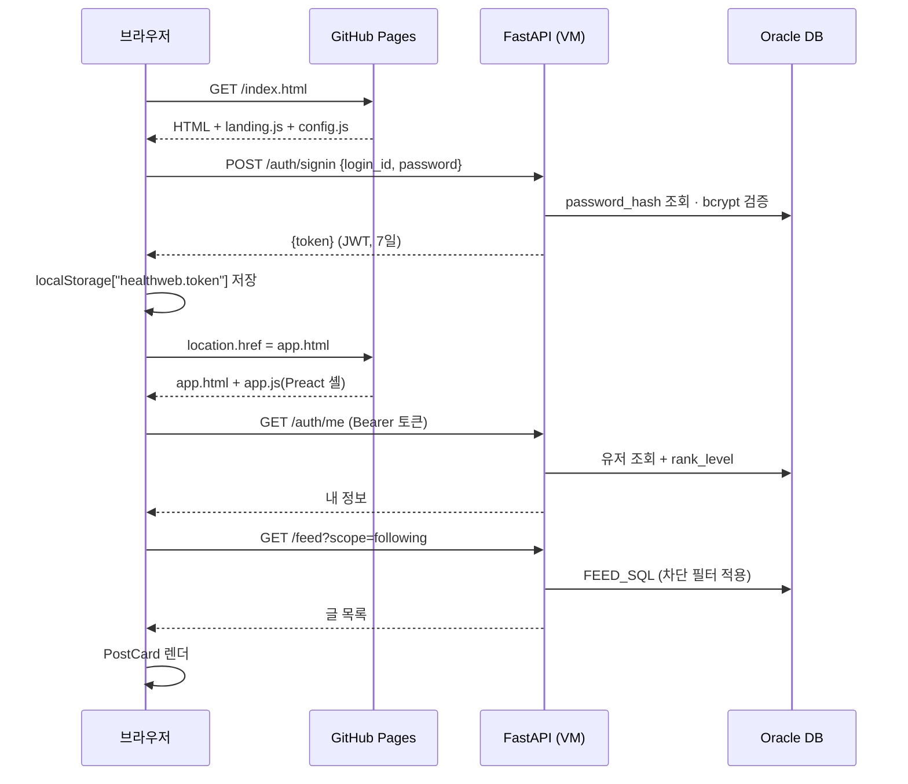
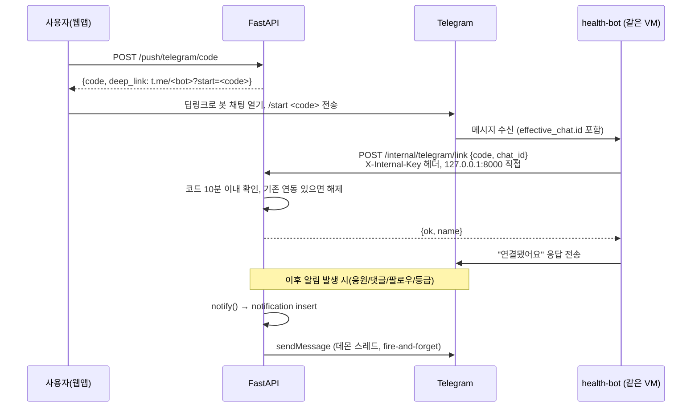
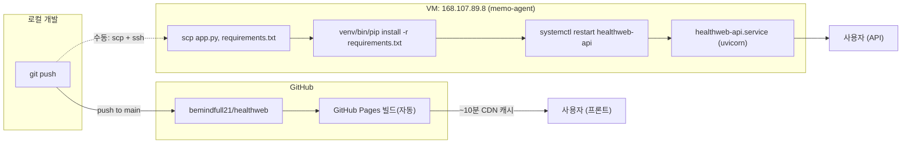

# 기술 아키텍처

## 1. 한눈에 보기

프론트(정적)와 백엔드(API)가 **완전히 분리된 두 개의 배포처**에 각각 산다. 둘 사이엔 빌드 파이프라인이 없다 — 둘 다 파일을 그대로 서빙한다.

**왜 이렇게 나눴나**: GitHub Pages는 무료·CDN 내장이라 정적 자산에 적합하지만 서버 코드를 못 돌린다.
그래서 인증이 필요한 로직(DB 접근, JWT 발급, 이미지 처리)만 별도 VM의 FastAPI가 맡고,
브라우저가 두 출처(GitHub Pages 도메인 + VM 도메인)에 각각 요청하는 구조다 — **CORS가 항상 걸린다**(`ALLOW_ORIGIN` 하나만 허용).

## 2. 요청 흐름 — 로그인 후 첫 화면

## 3. 요청 흐름 — 텔레그램 알림 연동 (봇 ↔ API, Caddy 우회)

`/internal/*` 경로는 Caddy 설정에서 외부 요청은 404로 막고, 같은 VM 안의 봇 프로세스만 `127.0.0.1:8000`으로 직접 때린다.

## 4. 배포 토폴로지

**중요**: 프론트는 `git push`만으로 자동 배포되지만, **백엔드는 수동 배포**다(scp → pip install → systemctl restart).
둘의 배포 타이밍이 어긋날 수 있으므로, API 응답 스키마를 바꾸는 변경은 프론트보다 API를 먼저 배포해야 구버전 프론트가 깨지지 않는다.

## 5. 기술 스택

| 레이어 | 선택 | 비고 |
|---|---|---|
| 프론트 프레임워크 | Preact 10 + htm 3 | esm.sh CDN에서 직접 import, **빌드 스텝 없음** |
| 프론트 라우팅 | History API 직접 구현 | React Router 등 미사용, `useRoute()` 자체 구현 |
| 차트 | Chart.js 4 (jsDelivr CDN) | 스파크라인은 별도로 인라인 SVG 직접 그림(`Sparkline`) |
| 백엔드 프레임워크 | FastAPI + uvicorn | ASGI, `@app.on_event("startup")`에서 DB 커넥션 풀 생성 |
| DB 드라이버 | `oracledb` (thin mode) | mTLS wallet, 커넥션 풀 min=1/max=4 |
| 인증 | PyJWT(HS256) + bcrypt | 세션/리프레시 토큰 없음, 단일 JWT 7일 |
| 이미지 처리 | Pillow | EXIF 제거, 리사이즈, JPEG 재인코딩 |
| 리버스 프록시 / TLS | Caddy | 자동 인증서, `/internal/*` 외부 차단 |
| 프로세스 관리 | systemd | `healthweb-api.service`, `Restart=always` |
| 정적 호스팅 | GitHub Pages | Fastly CDN, `max-age=600` |

## 6. 알려진 아키텍처 리스크

- **단일 API 인스턴스** — VM 한 대, 오토스케일·로드밸런싱 없음. 트래픽 급증 시 그대로 병목.
- **백엔드 배포가 수동** — 배포 자동화(CI/CD) 없음, 사람이 SSH로 직접 재시작.
- **미디어 파일이 VM 로컬 디스크에만 존재** — 오프사이트 백업(OCI 등) 없음. VM 디스크 유실 시 사진 전부 소실 위험.
- **커넥션 풀이 프로세스당 max 4** — 동시 요청이 몰리면 DB 커넥션 대기 발생 가능.
- **레이트리밋이 인메모리** — `rate_ok()`가 프로세스 메모리에 상태를 두므로 재시작하면 초기화되고, 여러 인스턴스로 스케일하면 공유 안 됨.
