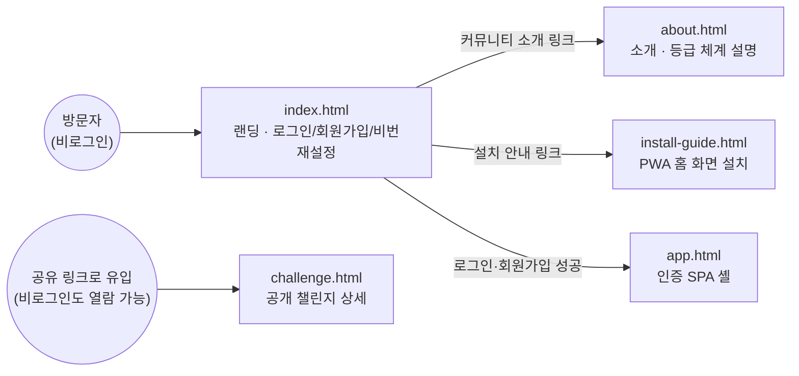
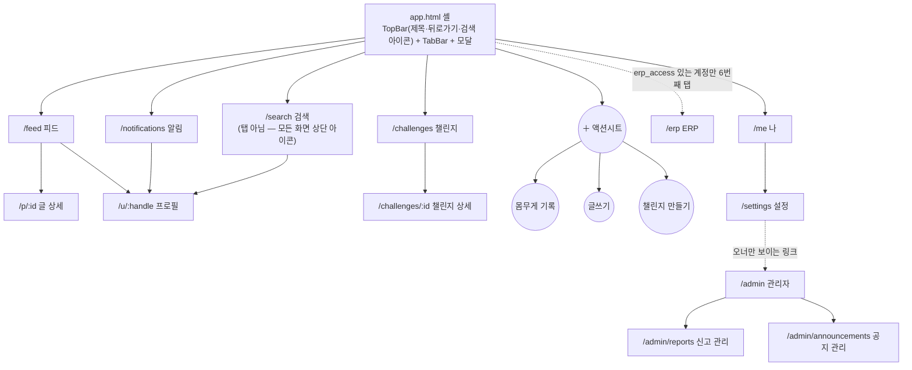

# 정보구조 (IA)

> 이 문서도 다른 설계문서와 마찬가지로 **지금 실제로 배포된 상태**를 기준으로 한다. 번호가 09인 이유는 새로 추가된 문서라
> 순서상 자연스러운 위치(01 PRD~02 유저스토리 뒤)가 아니라 끝에 붙였기 때문 — 기존 문서 번호(`04-API명세`, `05-ERD` 등)를
> 다른 곳에서 이미 참조하고 있어 전체 재번호를 피했다.

## 1. 전체 그림

사이트는 **공개 영역**(비로그인, 정적 HTML 여러 장)과 **인증 영역**(`app.html` 하나짜리 SPA) 두 켜로 나뉜다.
공개 페이지들은 서로 독립적인 정적 파일이고, 로그인 이후 화면 전환은 전부 `app.html` 안에서 클라이언트 라우팅(`history.pushState`)으로 일어난다 — 페이지 새로고침 없음.

## 2. 공개 페이지 (비로그인)

| 파일 | 역할 | 주요 진입 경로 | 비고 |
|---|---|---|---|
| `index.html` | 랜딩 — 로그인/회원가입/비밀번호 재설정 탭 전환, 소개 발췌 | 직접 방문, 로그아웃 시 리다이렉트 | 인증 성공 시 `app.html`로 이동. 하단에 about.html·install-guide.html 링크 |
| `about.html` | 자기이해·자기수용·자기돌봄 소개, 등급(흑연~다이아몬드) 산정 기준표 | index.html 하단 링크 | 완전 정적, API 호출 없음 |
| `install-guide.html` | 홈 화면(PWA) 설치 방법 안내 | index.html 로그인 폼 아래 링크 | 완전 정적 |
| `challenge.html` | 특정 챌린지 1건의 공개 상세(제목·루틴·참여자 진행) | 챌린지 상세에서 "공유"로 생성된 링크 | 로그인 불필요 — `config.js`만 불러와 읽기 전용 API 호출 |

## 3. 인증 SPA 내비게이션 (`app.html`)

셸 구조는 고정이다: **상단바(TopBar)** + **화면 영역** + **하단 탭바(TabBar)**, 그 위에 필요할 때만 뜨는 **모달/시트**.

탭바는 `me.erp_access` 값에 따라 5개(`tabbar-5`) 또는 6개(`tabbar-6`) — ERP는 오너가 개별 부여한 계정에만 보인다.
검색은 탭이 아니라 `/search`를 제외한 모든 화면 상단바에 뜨는 아이콘이라, 사실상 어디서든 한 번에 진입 가능하다.

## 4. 라우트 인벤토리

| 경로 | 컴포넌트 | 탭바 표시 | 접근 조건 | 설명 |
|---|---|---|---|---|
| `/feed` | `FeedView` | 피드 | 로그인 | 팔로잉·전체 스코프 전환, 글 목록, "＋ 글쓰기" |
| `/p/:id` | `PostView` | (피드 소속) | 로그인 | 글 상세, 댓글, 응원, 신고 |
| `/u/:handle` | `ProfileView` | (직접 탭 없음 — 피드/알림/검색에서 진입) | 로그인 | 리치 프로필(자기소개·링크·위치·고정 글·추세), 팔로우, 차단 |
| `/challenges` | `ChallengesView` | 챌린지 | 로그인 | 챌린지 목록, 참여/생성 |
| `/challenges/:id` | `ChallengeView` | (챌린지 소속) | 로그인 | 데일리 체크인, 진행바, 나가기, 공개 링크 공유 |
| `/notifications` | `NotificationsView` | 알림 | 로그인 | 응원·댓글·팔로우·등급승급·공지 알림, 미읽음 뱃지 |
| `/me` | `MeView` | 나 | 로그인 | 내 기록·등급·설정 진입점 |
| `/settings` | `SettingsView` | (나 소속) | 로그인 | 아바타·프로필·비밀번호·공개설정·텔레그램 알림 연동, 오너면 관리자 링크 |
| `/search` | `SearchView` | 상단 아이콘(전역) | 로그인 | 사용자·글 검색 |
| `/erp` | `ErpView` | ERP(조건부) | `erp_access=true` | 구매/비용/재고/판매/손익 서브탭 — §5 참고 |
| `/admin` | `AdminHubView` | (설정 소속) | `is_owner=true` | 관리자 허브(신고·공지 진입점) |
| `/admin/reports` | `AdminReportsView` | (관리자 소속) | `is_owner=true` | 신고 처리 큐 |
| `/admin/announcements` | `AdminAnnouncementsView` | (관리자 소속) | `is_owner=true` | 공지 등록·수정·삭제 |

`/`, `/app.html`, `/404.html`, 그 외 정의 안 된 경로는 전부 `/feed`로 취급된다(폴백).

## 5. ERP 서브메뉴 (`/erp` 내부, 별도 라우트 아님)

구매/비용/재고/판매/손익 5개는 URL이 바뀌지 않는 탭 상태(`useState`)로만 전환된다 — 브라우저 뒤로가기로는 서브탭 간
이동이 안 되고, `/erp`를 벗어나야 히스토리가 쌓인다.

| 서브탭 | 컴포넌트 | 요약 |
|---|---|---|
| 구매 | `ErpPurchaseView` | 영수증 스크린샷 업로드 → AI 추출 → 편집 → 저장, 구매ID 자동 채번, 기간·미입고 필터 |
| 비용 | `ErpExpenseView` | 비용 등록(관련 구매ID 선택 가능, 기본 "기타"), 기간 조회, 금액 인라인 수정 |
| 재고 | `ErpStockView` | 입고O·미판매 재고 목록(상품 사진 포함), 판매/폐기 등록 |
| 판매 | `ErpSalesView` | 판매 이력 조회·수정·삭제, 폐기 건은 배지 표시 |
| 손익 | `ErpProfitView` | 월별 매출/구매원가/비용/수익 집계 |

## 6. 오버레이 (모달·시트) — 라우트가 아닌 것들

브라우저 주소창/히스토리에 흔적을 남기지 않는 화면들. 전부 `app.js`의 `modal` 상태(`null | 'sheet' | 'weight' | 'post' | 'challenge'`) 하나로 제어된다.

| 이름 | 여는 방법 | 내용 |
|---|---|---|
| `ActionSheet` | 탭바 "＋" | 몸무게 기록 / 글쓰기 / 챌린지 만들기 중 선택 |
| `WeightModal` | ActionSheet → 몸무게 기록 | 몸무게 입력, 진행 사진 첨부, 피드 공유 여부(`share`) |
| `PostModal` | ActionSheet → 글쓰기 | 글 작성(종류: 자랑/도전/성찰/그냥, 본문, 사진) |
| `ChallengeModal` | ActionSheet → 챌린지 만들기 | 제목, 데일리 루틴, 목표 일수 |

## 7. 공개 범위 요약

같은 SPA 안에서도 데이터마다 공개 범위가 다르다 — 화면 구조와 헷갈리지 않도록 짚어둔다.

| 데이터 | 기본 공개 범위 | 비고 |
|---|---|---|
| 몸무게 기록 | **비공개**(`weight_privacy=private` 기본값) | 공유 체크(`share=true`) 시에만 피드에 글로 노출 |
| 글·댓글·응원 | 공개(팔로잉/전체 피드에서 조회) | 양방향 차단 시 상호 숨김 |
| 프로필(자기소개·링크·위치 등) | 공개 | 차단 시 `{blocked_by_me}` 또는 404 |
| ERP 전체(구매·비용·재고·판매·손익) | **완전 비공개, 계정 간 격리** | 커뮤니티 기능과 무관 — `erp_access` 있는 계정도 서로의 데이터를 볼 수 없음, 오너만 권한 부여/회수 |
| 관리자 큐(신고·공지 관리) | 오너 전용 | `OWNER_LOGIN_ID` 하나로 판별, 역할(role) 테이블 없음 |
